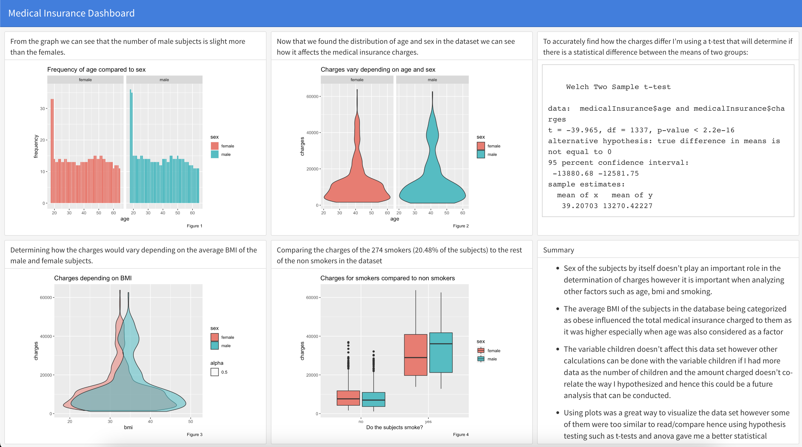

# Predicting-Medical-Insurance-Costs
I chose to analyze the “Medical Cost Personal Datasets” which forecasts the insurance charged depending on
factors such as age, sex, BMI, children, smoking, and region. 

I began cleaning the data by first summarizing the data to determine the data types of the variables and I changed a couple of variables to a factor data type (factor
variables are categorical variables as they only contain a specific set of values).
<ul>
  <li>To make my analysis more efficient I used more than one variable to see how the charges compared/changed. For
the age variable, I combined it with the sex variable to see how the charges varied.</li>
  <li>The plot for the age against the charges was quite similar for each sex (male and female) as seen below in Figure 3 hence I used a t-test to determine there was a significant statistical difference between the male and female means however the average charges did not differ much between each sex.</li>
  <li> I then checked the effect BMI had on the charges and found that the average BMI of the subjects fell in the obesity range (source: CDC) and from Figure 5 below I could see that men were charged more however by using a t-test I found the difference is significantly more (around $5k)for those who have a BMI>30 (obese) than those
who are not. </li>
</ul>

<ul>
  <li> The charges for the subjects who smoke compared to those who do not was significantly higher especially for men as they have a higher median charge as seen in Figure 9.</li>
</li> I couldn’t determine much from the plot of charges (Figure 10) depending on the region from where the subjects were from. Hence I used statistical tests to determine if there are any statistical differences between the means of three or more groups (ANOVA and Tukey HSD test). I concluded that the charges do not vary significantly over the regional distribution. Southeast is charged the highest.</li>
</ul>

<ul>
   <li> I chose to exclude the children variable as it did not affect the medical insurance charges. It did raise questions such as why are the charges low for 5 children but high for 3 since practically speaking a household with 5 kids should be charged more. Hence this variable- “children” doesn't affect this data set as the number of children and the amount charged doesn't co-relate the way I hypothesized and hence this could be a future analysis that can be conducted.</li>
</ul>
